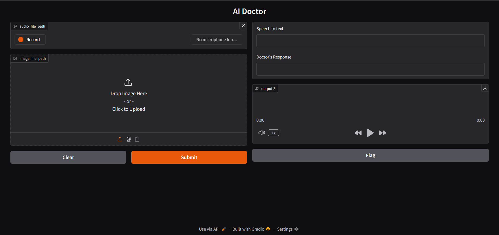
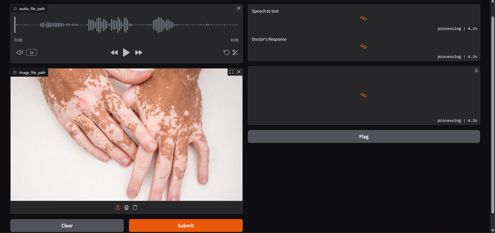
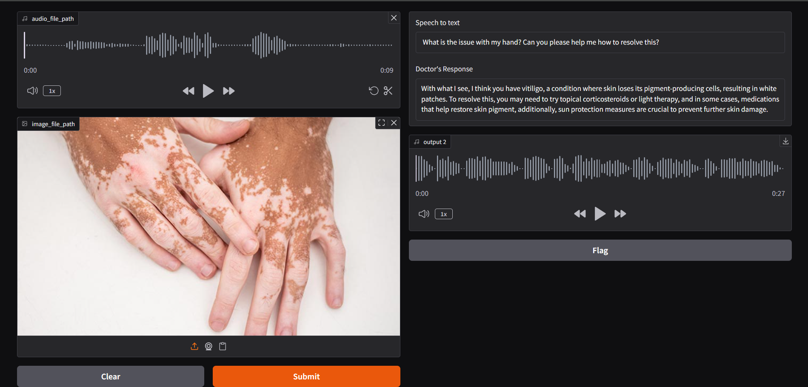

# AI-Doctor-MultiModel

# 🩺 AI Doctor - Voice and Image Based Medical Assistant

An AI-powered medical assistant that mimics a real doctor. The user speaks their symptoms and uploads an image (e.g., a medical scan), and the system returns a doctor-like response both in text and speech.

---

## 🔍 Features

- 🎤 Converts patient speech to text using Whisper.
- 🧠 Analyzes medical images with a multimodal LLM (LLaMA via Groq API).
- 💬 Provides a concise diagnosis-like response.
- 🔊 Converts doctor response to human-like speech using gTTS.
- 🌐 Simple Gradio-based web interface.

---

## 📸 Demo Preview

1. **Page**:

2. **Asking and Processing**: 

3. **Final out**



---

## 🧪 How It Works

1. **User speaks** into the microphone describing symptoms.
2. **Speech is transcribed** using Groq's Whisper model.
3. **User uploads a medical image** (like X-ray, scan, etc.).
4. **Text + image** is sent to the Groq API with LLaMA model for diagnosis.
5. **AI generates doctor-like response** in a natural language style.
6. **Text response is converted to speech** and played back to the user.

---

## 💻 Getting Started

### ✅ Prerequisites

- Python 3.9+
- A valid `GROQ_API_KEY` in `.env` file

### 📦 Installation

```bash
git clone https://github.com/Abinand99/AI-Doctor-MultiModel.git
cd AI-Doctor-MultiModel
pip install -r requirment.txt
```

## 🔐 Set up Environment
Create a .env file in the project root:
```bash
GROQ_API_KEY=your_groq_api_key_here
```

## 🚀 Run the App
Run:
```bash
python gradio_app.py
```
It will launch on http://127.0.0.1:7860

### 🧾 License
This project is for educational/demo purposes.
